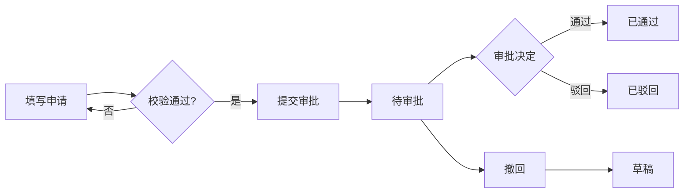

# 核心业务流程图

```mermaid
flowchart LR
  A[填写申请] --> B{校验通过?}
  B -- 否 --> A
  B -- 是 --> C[提交审批]
  C --> D[待审批]
  D --> E{审批决定}
  E -- 通过 --> F[已通过]
  E -- 驳回 --> G[已驳回]
  D --> H[撤回]
  H --> I[草稿]
```
